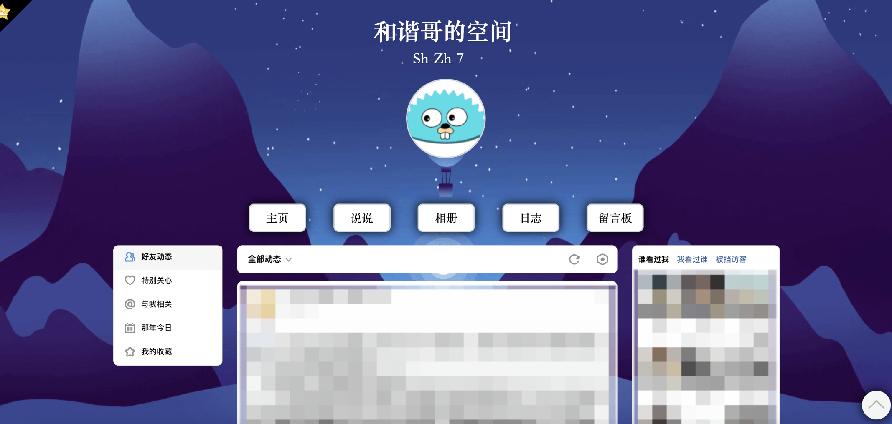

<h1 align=center>QZone Stylus</h1>

# 简介

时至今日，移动端已经成为使用QQ空间的主流平台，不得不承认手机版QQ空间确实非常精美。

但是对于作者这种PC的重度使用人群而言，偶尔也会使用web版的QQ空间。

而web版的QQ空间相对于手机版的就很糟心了，不仅排版布局非常旧式，而且QZone组似乎也没有维护的意思。

所以强迫症作者出手了，美化web版QQ空间势在必得！


# 下载

本项目需要配合Stylus/UserCSS等插件配合使用。

这些插件的用途就是把项目的CSS注入到QQ空间这个网页中。

### 1. 使用Userstyles

本项目已经发布到userstyles上，你可以通过这个[链接](https://userstyles.org/styles/218340/qzone-stylish)直接下载CSS。

### 2. 下载Release

你可以在Github上下载已经被提前构建好的CSS。

通过这个链接以获取：[点我](https://github.com/imShZh/QZone-Stylus/releases)

下载完毕之后通过Stylus或者UserCSS等插件注入到QQ空间中。

### 3. 手动构建

首先下载本项目：

```shell
git clone git@github.com:imShZh/QZone-stylus.git
```

然后使用Makefile组装成CSS：

```she
make
```

最后和Release一样，使用插件手动注入。


# 预览



# 许可

[MIT License](LICENSE)

Copyright ©️ 2021 Sh-Zh-7
